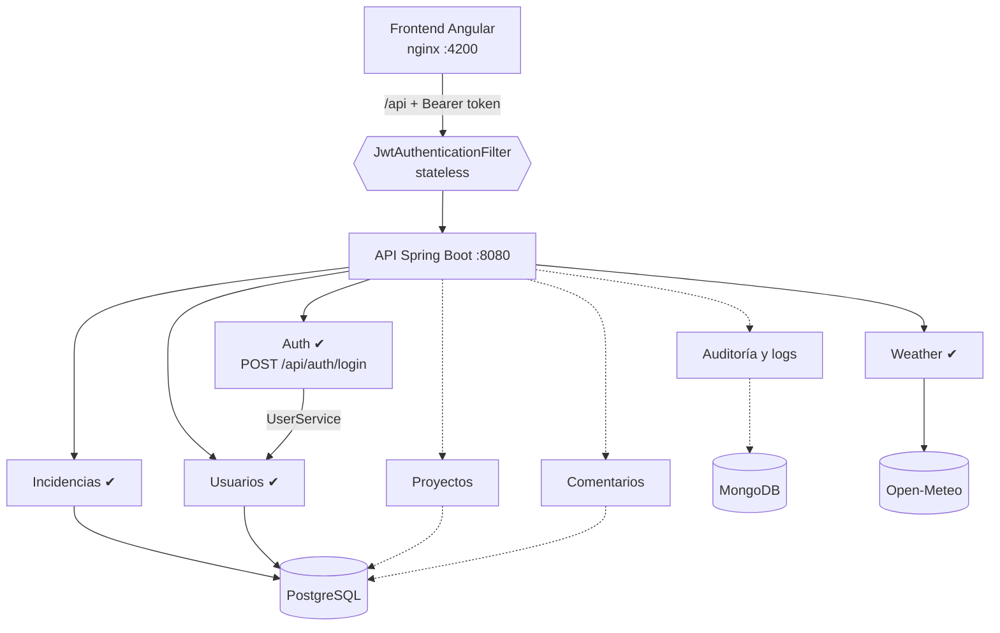
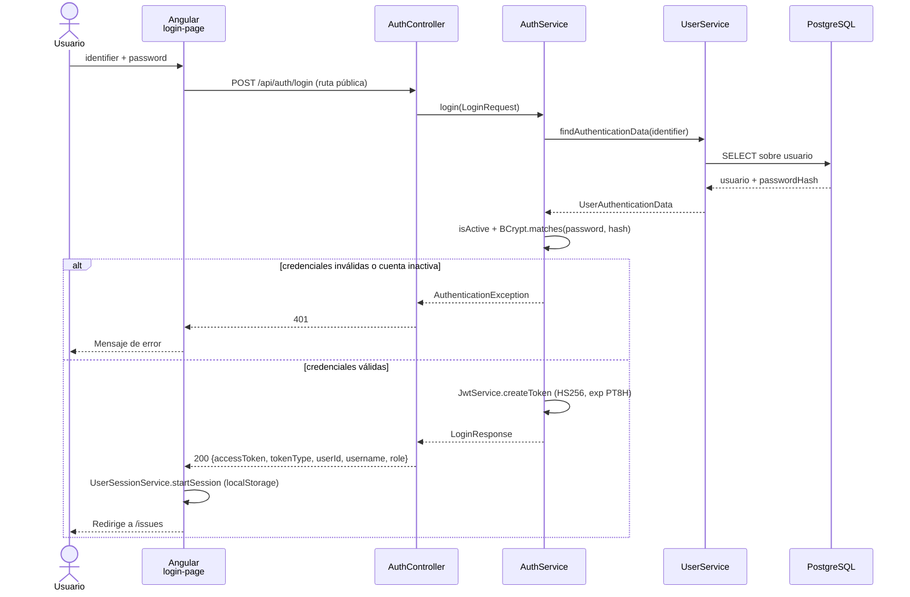
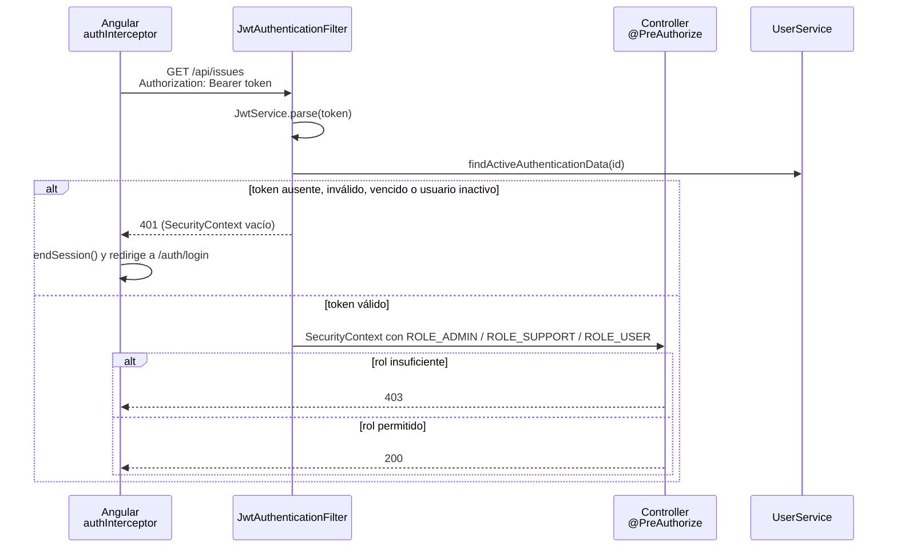

# Arquitectura

## Visión general

Adaptado del [documento de definición](definicion-proyecto-colaborativo-dev-jr.md), sección 5. Los módulos punteados aún no existen: son el backlog de los juniors.



## Decisión: monolito modular

Un solo backend Spring Boot con módulos internos bien separados. **Por qué**: facilita el aprendizaje y la ejecución local con Docker Compose, mantiene la separación de responsabilidades sin el costo operativo de microservicios. Los microservicios quedan explícitamente fuera de la primera etapa.

## Estructura de un módulo backend

Cada módulo vive en `com.minijira.<modulo>` y contiene sus propias capas:

```
com.minijira.<modulo>/
├── controller/   # endpoints REST
├── service/      # reglas de negocio
├── repository/   # acceso a datos (Spring Data JPA)
├── entity/       # entidades JPA
└── dto/          # objetos de entrada/salida de la API
```

Reglas: el flujo es siempre controller → service → repository; los módulos no se importan entre sí sin acuerdo previo; la API expone DTOs, nunca entidades. El esquema de PostgreSQL se versiona únicamente con changesets de Liquibase, que corren al arrancar el backend.

Módulos existentes: `auth`, `issue`, `user`, `weather` y el paquete transversal `common`. Un módulo nunca accede al `repository` de otro: se comunica a través de su `Service` — `auth` usa `UserService`, nunca `UserRepository`.

`com.minijira.weather` es el ejemplo de módulo sin base de datos: mantiene la misma separación controller → service → repository, pero el `repository` llama a una API externa (Open-Meteo) por HTTP en vez de a PostgreSQL. Ver [`docs/RESTCLIENT-PROXY.md`](RESTCLIENT-PROXY.md).

`com.minijira.auth` es el ejemplo de módulo sin entidad ni repositorio propios: `controller/`, `service/`, `dto/`, `config/`. Los datos de usuario los pide a `UserService`.

## Autenticación

Stateless con JWT firmado en HS256. El secreto viene de la variable de entorno `JWT_SECRET` (mínimo 32 bytes, la app no arranca si es más corto); la expiración es `security.jwt.expiration` en `application.yml` (hoy `PT8H`).

| Ruta | Acceso |
| --- | --- |
| `POST /api/auth/login` | Público |
| `GET /api/weather` | Público |
| `/swagger-ui/**`, `/v3/api-docs/**` | Público |
| `GET /api/issues`, `GET /api/issues/{id}` | Autenticado (cualquier rol) |
| `POST`/`PUT /api/issues/**` | `ADMIN` o `SUPPORT` |
| `DELETE /api/issues/{id}` | `ADMIN` |
| `/api/users/**` | `ADMIN` |

### Inicio de sesión



### Request protegido



En el frontend, `authInterceptor` agrega el header a toda petición a `/api/` salvo el propio login; `authGuard` protege `/issues` y `adminGuard` protege `/users`.

## Construido vs. pendiente

| Componente | Estado |
| --- | --- |
| Infraestructura (Docker Compose, Postgres, Mongo) | ✔ Construido |
| Módulo incidencias: crear, listar (con filtros), consultar, editar y eliminar en `/api/issues` + Swagger + Liquibase | ✔ Construido |
| Frontend Angular con listado, alta, edición y eliminación de incidencias | ✔ Construido |
| Eliminar incidencia | ✔ Construido (backend + botón en listado) |
| Módulo weather: proxy Open-Meteo con RestClient | ✔ Construido (ver RESTCLIENT-PROXY.md) |
| Cambios de estado/prioridad con reglas | Parcial: campos editables por PUT; faltan reglas de transición |
| Módulo `user`: usuarios y roles en `/api/users` + Liquibase 002/003 + feature Angular `users` | ✔ Construido |
| Autenticación JWT | ✔ Construido — módulo `auth`, `POST /api/auth/login`, filtro stateless y control de roles |
| Proyectos | Pendiente (junior) |
| Comentarios | Pendiente (junior) |
| Auditoría e historial en MongoDB | Pendiente (junior) — Mongo ya está en compose, sin uso |
| Dashboard de métricas | Pendiente (junior) |
