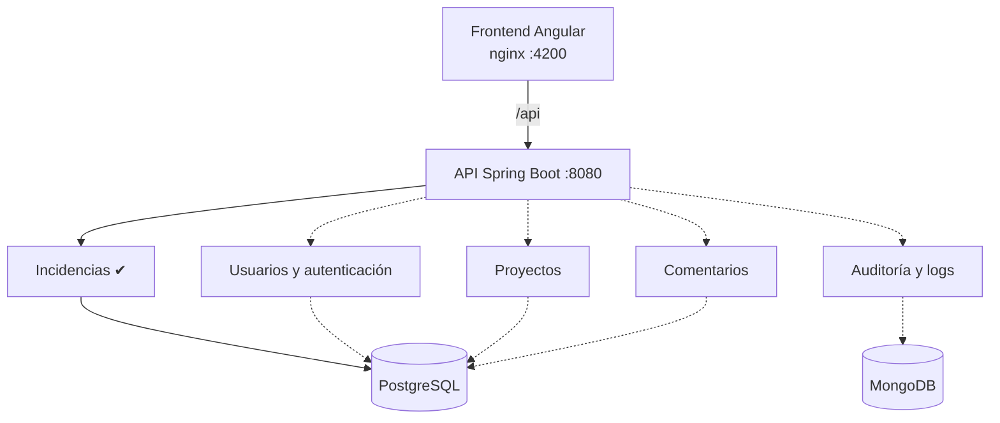

# Arquitectura

## Visión general

Adaptado del [documento de definición](definicion-proyecto-colaborativo-dev-jr.md), sección 5. Los módulos punteados aún no existen: son el backlog de los juniors.



## Decisión: monolito modular

Un solo backend Spring Boot con módulos internos bien separados. **Por qué**: facilita el aprendizaje y la ejecución local con Docker Compose, mantiene la separación de responsabilidades sin el costo operativo de microservicios. Los microservicios quedan explícitamente fuera de la primera etapa.

## Estructura de un módulo backend

Cada módulo vive en `com.minijira.<modulo>` y contiene sus propias capas:

```
com.minijira.<modulo>/
├── controller/   # endpoints REST
├── service/      # reglas de negocio
├── repository/   # acceso a datos (Spring Data JPA)
├── entity/       # entidades JPA
└── dto/          # objetos de entrada/salida de la API
```

Reglas: el flujo es siempre controller → service → repository; los módulos no se importan entre sí sin acuerdo previo; la API expone DTOs, nunca entidades. El esquema de PostgreSQL se versiona únicamente con changesets de Liquibase, que corren al arrancar el backend.

## Construido vs. pendiente

| Componente | Estado |
| --- | --- |
| Infraestructura (Docker Compose, Postgres, Mongo) | ✔ Construido |
| Módulo incidencias: crear, listar, consultar y eliminar en `/api/issues` + Swagger + Liquibase | ✔ Construido |
| Frontend Angular con listado y alta de incidencias | ✔ Construido |
| Editar incidencia (PUT + formulario de edición) | Pendiente (junior) — primera tarea sugerida |
| Eliminar incidencia (`DELETE /api/issues/{id}`) | ✔ Backend construido; botón del frontend pendiente |
| Autenticación JWT, usuarios y roles | Pendiente (junior) |
| Proyectos | Pendiente (junior) |
| Comentarios | Pendiente (junior) |
| Auditoría e historial en MongoDB | Pendiente (junior) — Mongo ya está en compose, sin uso |
| Dashboard de métricas | Pendiente (junior) |
