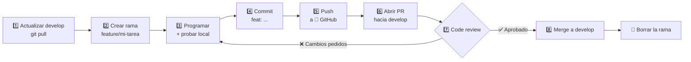
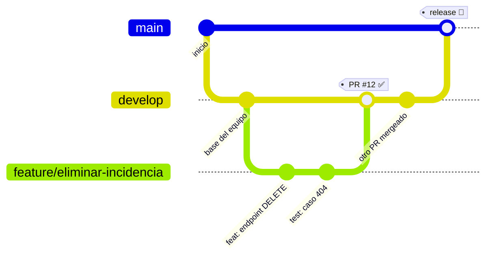
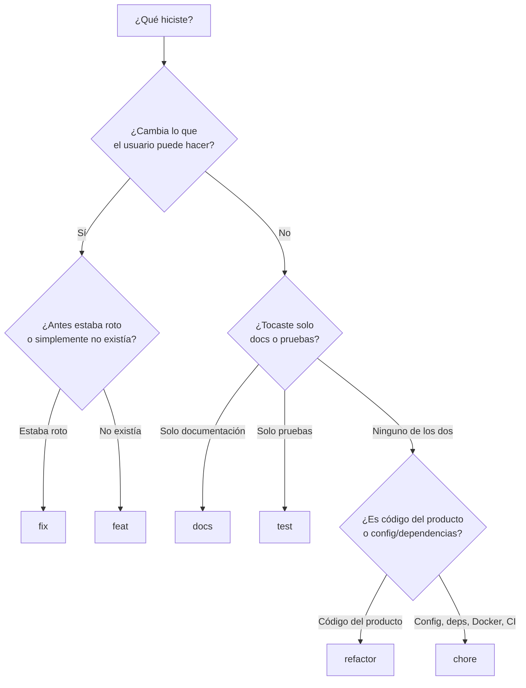
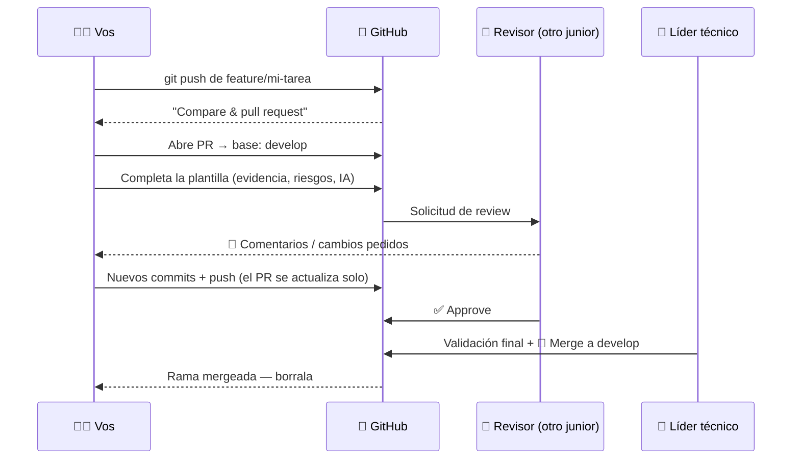

# 🐙 Flujo Git paso a paso (rama → commit → push → PR → develop)

Guía práctica para el trabajo diario en este repo. Complementa a [CONTRIBUTING.md](../CONTRIBUTING.md): allá están las reglas, acá está el **cómo se hace**.

Regla de oro: **nadie commitea directo sobre `main` ni sobre `develop`**. Todo entra por Pull Request.

---

## El mapa completo



---

## Cómo se ven las ramas



- `main` → versión estable. Solo el líder técnico integra `develop → main`.
- `develop` → integración de todo lo aprobado. **Tu rama nace acá y vuelve acá.**
- `feature/*` / `fix/*` → tu trabajo, una rama por tarea.

---

## 1️⃣ Partir de un `develop` actualizado

Si arrancás desde un `develop` viejo, después vas a tener conflictos que no eran tuyos.

```bash
git checkout develop
git pull origin develop
```

## 2️⃣ Crear tu rama

Una tarea = una rama. El nombre describe la tarea, no tu nombre.

```bash
git checkout -b feature/eliminar-incidencia
```

| Tipo | Prefijo | Ejemplo |
| --- | --- | --- |
| Funcionalidad nueva | `feature/` | `feature/autenticacion-jwt` |
| Corrección de bug | `fix/` | `fix/error-validacion-titulo` |

## 3️⃣ Programar y probar localmente

Antes de commitear, la app tiene que **compilar y correr**. Ver [README](../README.md#levantar-todo).

```bash
docker compose up --build          # todo el stack
# o solo backend:
cd apps/backend && ./mvnw spring-boot:run
```

## 4️⃣ Commit

Primero mirá **qué** estás por commitear. Nunca `git add .` a ciegas.

```bash
git status                 # ¿qué archivos cambiaron?
git diff                   # ¿qué cambió exactamente? leelo
git add apps/backend/src/...   # agregá solo lo que corresponde
git commit -m "feat: agregar endpoint DELETE /api/issues/{id}"
```

Formato: `tipo: descripción en imperativo y minúscula`.

| Tipo | Usalo cuando... | Ejemplo real de este repo |
| --- | --- | --- |
| `feat` | el usuario puede hacer **algo que antes no podía** | `feat: agregar endpoint DELETE /api/issues/{id}` |
| `fix` | algo **estaba mal y ahora anda**: error, dato incorrecto, pantalla rota | `fix: validar título vacío al crear incidencia` |
| `docs` | tocaste **solo** documentación: README, comentarios, Swagger, este archivo | `docs: documentar el flujo de PR` |
| `refactor` | movés/renombrás/simplificás código y **el comportamiento no cambia** | `refactor: extraer validación de prioridad al service` |
| `test` | agregás o arreglás **pruebas**, sin tocar el código productivo | `test: cubrir caso 404 en DELETE de incidencia` |
| `chore` | mantenimiento que **no afecta el producto**: dependencias, Docker, CI, `.gitignore` | `chore: actualizar Angular a 19.2` |

### ¿`feat` o `fix`? La pregunta que lo resuelve



### Casos que confunden

| Situación | Tipo correcto | Por qué |
| --- | --- | --- |
| Agregás validación que faltaba y dejaba pasar datos inválidos | `fix` | había un comportamiento incorrecto |
| Agregás validación a un endpoint **nuevo**, en el mismo PR que lo crea | `feat` | es parte de la funcionalidad nueva, no un arreglo aparte |
| Cambiás un texto de la interfaz porque decía algo equivocado | `fix` | el usuario veía información incorrecta |
| Renombrás variables para que se entiendan mejor | `refactor` | nadie nota la diferencia usando la app |
| Arreglás una prueba que fallaba por estar mal escrita | `test` | el bug estaba en la prueba, no en el producto |
| Arreglás el código **porque** una prueba lo detectó | `fix` | el bug estaba en el producto |
| Agregás una librería nueva para implementar una feature | `feat` | el commit se nombra por su objetivo, no por el medio |
| Actualizás una librería sin cambiar funcionalidad | `chore` | mantenimiento |

**Regla práctica**: si dudás entre dos tipos, el commit probablemente esté haciendo dos cosas. Separalo en dos commits.

### El prefijo de la rama sigue la misma lógica

La rama se nombra por el **objetivo de la tarea**, aunque adentro tenga commits de varios tipos:

- Tarea "implementar borrado de incidencias" → rama `feature/eliminar-incidencia`, con commits `feat:`, `test:` y `docs:` adentro.
- Tarea "el listado no muestra la prioridad" → rama `fix/prioridad-no-visible`, con commits `fix:` y quizá `test:`.

**Commits atómicos**: un cambio por commit. No mezcles un fix + un refactor + una feature en el mismo commit — si el revisor tiene que separar mentalmente tres cosas en un solo diff, el review se vuelve lento y se escapan errores.

## 5️⃣ Push a GitHub 🐙

La primera vez la rama no existe en el remoto, por eso el `-u`:

```bash
git push -u origin feature/eliminar-incidencia
```

Los siguientes pushes de esa misma rama son solo `git push`.

## 6️⃣ Abrir el Pull Request



En GitHub: **Pull requests → New pull request**, o el botón **Compare & pull request** que aparece después del push.

> ⚠️ Verificá el destino: `base: develop` ← `compare: feature/tu-rama`. GitHub propone `main` por defecto; hay que cambiarlo.

También se puede desde la terminal:

```bash
gh pr create --base develop --fill
```

La descripción se completa con [`.github/pull_request_template.md`](../.github/pull_request_template.md): issue, problema, solución, endpoints, cambios de BD, evidencia, uso de IA, riesgos y checklist.

Antes de darle "Create", pasá la checklist de [`.claude/skills/pr-ready`](../.claude/skills/pr-ready/SKILL.md) — o como mínimo:

- [ ] Compila y corre local.
- [ ] Sin secretos ni credenciales.
- [ ] Validaciones y manejo de errores.
- [ ] Logs útiles, sin datos sensibles.
- [ ] Pruebas agregadas o actualizadas.
- [ ] Documentación actualizada.
- [ ] Podés explicar cada línea que entregás.

## 7️⃣ Code review

Primero te revisa **otro junior**, después valida el **líder técnico**. Un PR no se aprueba solo porque compila.

Si te piden cambios: seguís trabajando **en la misma rama**. Cada push nuevo actualiza el PR automáticamente — no abras otro PR.

```bash
# ...hacés las correcciones...
git add apps/backend/src/...
git commit -m "fix: validar id inexistente en DELETE"
git push
```

## 8️⃣ Merge y limpieza

El merge lo hace quien aprueba. Después:

```bash
git checkout develop
git pull origin develop              # traés tu trabajo ya integrado
git branch -d feature/eliminar-incidencia   # borrás la rama local
```

La rama remota se borra con el botón **Delete branch** que GitHub muestra en el PR mergeado.

---

## 🚑 Situaciones comunes

### "Mi rama quedó atrasada respecto de develop"

Pasa cuando mergean otros PRs mientras trabajás. Traés `develop` a tu rama:

```bash
git checkout develop && git pull origin develop
git checkout feature/mi-tarea
git merge develop
# si hay conflictos: los resolvés en el editor, luego:
git add <archivos-resueltos>
git commit
git push
```

### "Empecé a trabajar y me olvidé de crear la rama"

Si todavía no commiteaste, la rama nueva se lleva tus cambios:

```bash
git checkout -b feature/mi-tarea   # los cambios sin commitear te siguen
```

### "Commiteé algo que no debía (un `.env`, un secreto)"

Avisá **antes** de pushear. Si aún no hiciste push:

```bash
git reset --soft HEAD~1   # deshace el commit, conserva los cambios
```

Si ya hiciste push, avisá al líder técnico: un secreto expuesto se rota, no se borra del historial y listo.

### "¿En qué rama estoy?"

```bash
git status          # rama actual + archivos modificados
git log --oneline --graph --all -15   # el árbol de ramas en la terminal
```

---

## Resumen en 8 comandos

```bash
git checkout develop && git pull origin develop   # 1
git checkout -b feature/mi-tarea                  # 2
#   ...programar y probar...                      # 3
git add <archivos> && git commit -m "feat: ..."   # 4
git push -u origin feature/mi-tarea               # 5
#   ...abrir PR hacia develop en 🐙 GitHub...     # 6
#   ...atender el review y volver a pushear...    # 7
git checkout develop && git pull && git branch -d feature/mi-tarea   # 8
```
