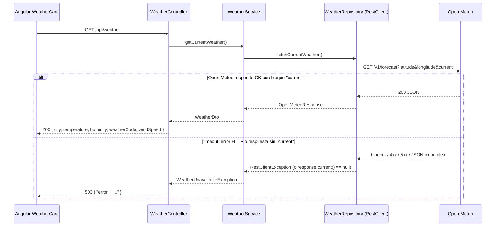

# Consumir un servicio externo con RestClient (patrón proxy) — módulo weather

## Qué problema resuelve

`GET /api/weather` devuelve el clima actual de Asunción, pero el dato en realidad viene de [Open-Meteo](https://open-meteo.com), una API externa. El frontend **nunca llama a Open-Meteo directo**: llama a nuestro backend, y el backend actúa de proxy hacia el proveedor.

Ventajas de este patrón:

- **Una sola URL para el frontend**: `/api/weather`, siempre relativa, sin importar qué proveedor externo esté detrás ni si cambia mañana.
- **Contrato propio y estable**: el frontend depende de `WeatherDto` (nuestro contrato), no del JSON de Open-Meteo. Si Open-Meteo cambia su respuesta, solo se toca el backend.
- **Sin exponer la API externa ni problemas de CORS**: el navegador nunca hace una request cross-origin a `open-meteo.com`; solo habla con nuestro propio dominio.
- **Punto único de control**: timeouts, manejo de errores y (a futuro) caché se resuelven en un solo lugar del backend, no en cada cliente que consuma el dato.

## Diagrama de secuencia



## Capa por capa

### 1. Configuración (`application.yml`)

```yaml
spring:
  http:
    client:
      connect-timeout: 3s
      read-timeout: 3s

weather:
  open-meteo:
    url: https://api.open-meteo.com/v1/forecast
```

**Por qué 3s**: un proveedor externo lento no puede colgar nuestra API. Si Open-Meteo no responde en 3 segundos, se corta y se responde 503 en vez de dejar la request esperando indefinidamente. La URL vive en configuración, no hardcodeada en el código — así se puede cambiar por ambiente sin recompilar.

### 2. WeatherRepository — el cliente HTTP

```java
public WeatherRepository(RestClient.Builder restClientBuilder,
        @Value("${weather.open-meteo.url}") String openMeteoUrl) {
    this.restClient = restClientBuilder.baseUrl(openMeteoUrl).build();
}

public OpenMeteoResponse fetchCurrentWeather() {
    return restClient.get()
            .uri(uriBuilder -> uriBuilder
                    .queryParam("latitude", ASUNCION_LATITUDE)
                    .queryParam("longitude", ASUNCION_LONGITUDE)
                    .queryParam("current", CURRENT_FIELDS)
                    .build())
            .retrieve()
            .body(OpenMeteoResponse.class);
}
```

`RestClient.Builder` es la fábrica que Spring Boot autoconfigura con los timeouts de `application.yml`; el repository solo le fija la `baseUrl` inyectada por `@Value`. `.retrieve().body(...)` hace la request y deserializa el JSON a `OpenMeteoResponse`. Este repository cumple el mismo rol que un repository de base de datos (capa de acceso a datos): la única diferencia es que la fuente es HTTP en vez de SQL.

### 3. OpenMeteoResponse — DTO de entrada, tolerante a cambios

```java
@JsonIgnoreProperties(ignoreUnknown = true)
public record OpenMeteoResponse(Current current) {

    @JsonIgnoreProperties(ignoreUnknown = true)
    public record Current(
            @JsonProperty("temperature_2m") Double temperature,
            @JsonProperty("relative_humidity_2m") Integer humidity,
            @JsonProperty("weather_code") Integer weatherCode,
            @JsonProperty("wind_speed_10m") Double windSpeed
    ) {}
}
```

`@JsonIgnoreProperties(ignoreUnknown = true)` es clave: Open-Meteo devuelve muchos más campos de los que usamos (`latitude`, `elevation`, `current_units`, etc.). Sin esa anotación, cualquier campo nuevo que agregue el proveedor rompería la deserialización. Es un `record` porque es un objeto de datos inmutable que solo transporta el JSON externo — no tiene comportamiento propio.

### 4. WeatherService — traduce errores, no solo los reenvía

```java
public WeatherDto getCurrentWeather() {
    OpenMeteoResponse response;
    try {
        response = weatherRepository.fetchCurrentWeather();
    } catch (RestClientException ex) {
        log.error("[WEATHER] Open-Meteo no disponible: {}", ex.getMessage());
        throw new WeatherUnavailableException("Weather service unavailable", ex);
    }

    if (response == null || response.current() == null) {
        log.error("[WEATHER] Open-Meteo respondió sin el bloque 'current'");
        throw new WeatherUnavailableException("Weather service returned an invalid response");
    }
    ...
}
```

La parte importante es el segundo chequeo: **validar el efecto real, no solo la ausencia de excepción**. Open-Meteo puede responder `200 OK` con un JSON que no trae el bloque `current` (por ejemplo, si se piden parámetros mal formados). Un `try/catch` solo detecta errores de transporte (timeout, 4xx/5xx); no detecta una respuesta "exitosa" pero incompleta. Por eso el service chequea el contenido real antes de darlo por bueno.

### 5. GlobalExceptionHandler — 503 consistente

```java
@ExceptionHandler(WeatherUnavailableException.class)
@ResponseStatus(HttpStatus.SERVICE_UNAVAILABLE)
public Map<String, String> handleWeatherUnavailable(WeatherUnavailableException ex) {
    return Map.of("error", ex.getMessage());
}
```

El controller (`WeatherController`) no sabe nada de Open-Meteo ni de HTTP externo: solo llama a `weatherService.getCurrentWeather()`. Si algo falla, la excepción sube hasta el handler global, que la traduce a un 503 con el mismo formato `{"error": "..."}` que usan los demás errores de la API (ver `IssueNotFoundException` → 404).

### 6. WeatherDto — el contrato propio

```java
public record WeatherDto(
        String city, Double temperature, Integer humidity, Integer weatherCode, Double windSpeed
) {}
```

Esto es lo único que ve el frontend. No es lo mismo que `OpenMeteoResponse`: tiene sus propios nombres de campo (`city` en vez de `latitude`/`longitude`), no expone la estructura anidada del proveedor, y el `city` lo agrega el backend (Open-Meteo solo devuelve coordenadas).

## Cómo probarlo

- **`WeatherRepositoryTest`** (`@RestClientTest` + `MockRestServiceServer`): levanta un servidor HTTP mock y verifica que el repository arme bien la URL y los query params (`latitude=-25.2637`, `longitude=-57.5759`), que deserialice correctamente el JSON `snake_case` de Open-Meteo, y que un 502 del proveedor se traduzca en `RestClientException`.
- **`WeatherControllerTest`** (`@WebMvcTest` + `MockitoBean` sobre `WeatherRepository`): prueba controller + service + `GlobalExceptionHandler` juntos con `MockMvc`, mockeando solo el borde externo (`WeatherRepository`). Verifica el 200 con el JSON esperado, el 503 cuando el repository lanza `ResourceAccessException`, y el 503 cuando la respuesta no trae `current`.

Ejemplo con curl:

```bash
curl http://localhost:8080/api/weather
# {"city":"Asunción","temperature":24.1,"humidity":60,"weatherCode":3,"windSpeed":12.3}
```

## Cómo replicar el patrón para otro servicio externo

1. Creá un paquete nuevo `com.minijira.<modulo>` con `controller/`, `service/`, `repository/`, `dto/`, `exception/`.
2. Agregá la URL del proveedor como propiedad en `application.yml` (nunca hardcodeada en el código).
3. Escribí un `Repository` que reciba `RestClient.Builder` por constructor, le fije la `baseUrl` y exponga un método que devuelva el DTO de entrada.
4. Definí el DTO de entrada con `@JsonIgnoreProperties(ignoreUnknown = true)`, mapeando solo los campos que necesitás.
5. Definí un DTO de salida propio (el contrato que ve el frontend), desacoplado del formato del proveedor.
6. Escribí un `Service` que llame al repository, capture las excepciones de transporte y **valide también el contenido de una respuesta "exitosa"**, traduciendo cualquier falla a una excepción propia del módulo.
7. Creá esa excepción y su `@ExceptionHandler` en (o junto a) `GlobalExceptionHandler`, con el código HTTP que corresponda (503 si el proveedor no está disponible).
8. Escribí los tests: uno de integración del repository contra un servidor mock (`@RestClientTest`) y uno del controller con el repository mockeado (`@WebMvcTest`).

## Errores comunes

- **No configurar timeouts**: sin `connect-timeout`/`read-timeout`, un proveedor lento cuelga la request indefinidamente.
- **Exponer el DTO externo directo**: el frontend termina acoplado al formato del proveedor y cualquier cambio externo rompe el cliente.
- **No manejar la respuesta parcial**: un `200 OK` sin los datos esperados no es un error de transporte; hay que validarlo explícitamente.
- **Hardcodear la URL** en el código en vez de configurarla: dificulta cambiar de proveedor o de ambiente (dev/staging/prod).
