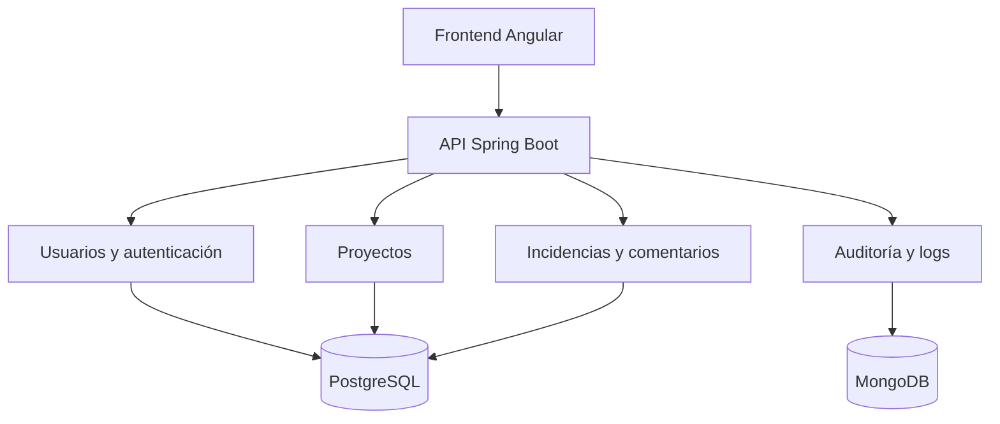
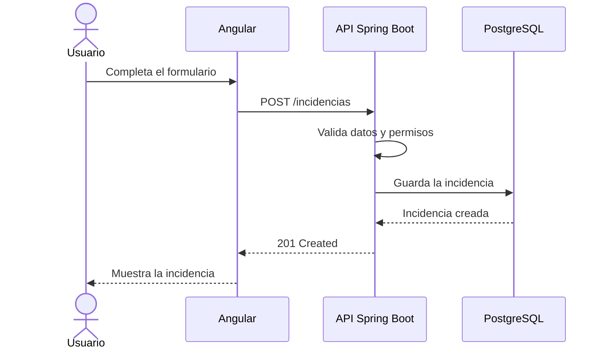

# Proyecto colaborativo para desarrolladores junior

## Mini sistema de gestión de incidencias

## 1. Presentación

Este documento define un proyecto colaborativo que deberá ser analizado, documentado y desarrollado por los integrantes del equipo junior, con el acompañamiento de un líder técnico.

El proyecto consiste en una plataforma interna para registrar problemas técnicos, asignarlos a un responsable, realizar su seguimiento y documentar su resolución. Será una versión reducida de herramientas como Jira, Linear o un sistema de mesa de ayuda.

El objetivo principal no es únicamente terminar la plataforma. El proyecto debe permitir que los desarrolladores practiquen un flujo de trabajo profesional completo:

- Uso responsable de inteligencia artificial.
- Análisis funcional y técnico.
- Diseño de arquitectura.
- Documentación técnica.
- Desarrollo frontend y backend.
- Bases de datos relacionales y no relacionales.
- Git, ramas y Pull Requests.
- Code review entre compañeros.
- Pruebas y validaciones.
- Logs y debugging.
- Diagnóstico y corrección de errores.
- Docker y ejecución local.

---

## 2. Modalidad de trabajo

La plataforma deberá ser desarrollada por los juniors. No recibirán el proyecto completamente programado.

El líder técnico proporcionará:

- El objetivo general.
- Los requerimientos principales.
- Las tecnologías obligatorias.
- Una arquitectura inicial de referencia.
- Las reglas de trabajo con GitHub.
- Los criterios de aceptación de cada tarea.
- Orientación técnica durante el desarrollo.
- La revisión y aprobación técnica final.

Cada junior deberá:

1. Comprender el requerimiento asignado.
2. Analizarlo con apoyo de herramientas de IA.
3. Dividirlo en tareas pequeñas.
4. Documentar la solución propuesta.
5. Crear los diagramas necesarios.
6. Desarrollar la funcionalidad.
7. Agregar validaciones, logs y pruebas.
8. Ejecutar y probar el proyecto localmente.
9. Crear un Pull Request.
10. Participar en el code review de otro compañero.
11. Corregir las observaciones recibidas.
12. Explicar el funcionamiento de su implementación.

La inteligencia artificial será una herramienta de apoyo. El desarrollador deberá poder explicar el código generado, justificar sus decisiones y demostrar que la funcionalidad opera correctamente.

---

## 3. Objetivo funcional

Construir una plataforma web que permita:

- Registrar usuarios.
- Iniciar sesión de manera segura.
- Crear proyectos internos.
- Registrar incidencias técnicas.
- Asignar incidencias a integrantes del equipo.
- Establecer prioridad, categoría y estado.
- Agregar comentarios.
- Consultar el historial de modificaciones.
- Visualizar métricas básicas.
- Registrar logs y errores de la aplicación.

---

## 4. Tecnologías propuestas

| Área | Tecnología |
| --- | --- |
| Frontend | Angular |
| Backend | Java y Spring Boot |
| Base de datos relacional | PostgreSQL |
| Base de datos no relacional | MongoDB |
| Autenticación | JWT |
| Documentación de API | Swagger / OpenAPI |
| Pruebas de API | Postman o Bruno |
| Entorno local | Docker y Docker Compose |
| Control de versiones | Git y GitHub |
| Documentación | Markdown (`.md`) |
| Diagramas | Mermaid |

Se recomienda comenzar con un **monolito modular**. Esta alternativa facilita el aprendizaje y la ejecución local, pero mantiene una separación clara entre las distintas responsabilidades del sistema.

No se utilizarán microservicios en la primera etapa.

---

## 5. Arquitectura general



### Organización interna de cada módulo

Cada módulo del backend podrá contener:

- `controller`: exposición de endpoints REST.
- `service`: reglas y casos de uso.
- `repository`: acceso a datos.
- `entity` o `domain`: representación del dominio.
- `dto`: objetos de entrada y salida.
- `mapper`: conversión entre entidades y DTO.
- `exception`: excepciones específicas.
- `test`: pruebas unitarias y de integración.

La separación exacta deberá estar documentada antes de iniciar la implementación.

---

## 6. Módulos funcionales

### 6.1. Autenticación y usuarios

Funcionalidades:

- Registro de usuarios.
- Inicio de sesión.
- Autenticación mediante JWT.
- Consulta y actualización del perfil.
- Activación o desactivación de usuarios.
- Roles: administrador, soporte y usuario.
- Control de acceso según el rol.

### 6.2. Proyectos

Funcionalidades:

- Crear un proyecto.
- Editar sus datos.
- Listar proyectos.
- Consultar un proyecto.
- Agregar o quitar miembros.
- Consultar las incidencias relacionadas.

### 6.3. Incidencias

Funcionalidades:

- Crear una incidencia.
- Editar una incidencia.
- Consultar su detalle.
- Listar incidencias.
- Asignar un responsable.
- Establecer una prioridad.
- Establecer una categoría.
- Cambiar el estado.
- Buscar y filtrar incidencias.

Estados iniciales:

- Pendiente.
- En progreso.
- Resuelta.
- Cerrada.

Prioridades iniciales:

- Baja.
- Media.
- Alta.
- Crítica.

### 6.4. Comentarios

Funcionalidades:

- Agregar comentarios a una incidencia.
- Listar comentarios en orden cronológico.
- Mostrar el autor y la fecha.
- Editar comentarios propios.
- Eliminar comentarios propios, si las reglas lo permiten.

### 6.5. Historial y auditoría

Funcionalidades:

- Registrar cambios de estado.
- Registrar cambios de responsable.
- Registrar modificaciones de prioridad.
- Identificar al usuario que realizó el cambio.
- Guardar la fecha y hora.
- Consultar la línea de tiempo de una incidencia.

### 6.6. Logs y errores

Funcionalidades técnicas:

- Logs de información, advertencia y error.
- Identificador único por petición.
- Registro global de excepciones.
- Logs estructurados en formato JSON.
- Registro de errores relevantes en MongoDB.
- Consulta básica de errores desde la aplicación.
- Protección de datos sensibles en los logs.

Nunca se deben registrar contraseñas, tokens completos ni secretos.

### 6.7. Panel principal

Información inicial:

- Cantidad de incidencias por estado.
- Cantidad de incidencias por prioridad.
- Incidencias asignadas al usuario autenticado.
- Actividad reciente.
- Últimos errores registrados.

---

## 7. Alcance del MVP

La primera versión deberá incluir solamente:

1. Inicio de sesión con JWT.
2. Gestión básica de usuarios.
3. Creación y consulta de proyectos.
4. Creación y asignación de incidencias.
5. Cambios de estado y prioridad.
6. Comentarios.
7. Historial de modificaciones.
8. Logs y manejo global de errores.
9. Dashboard básico.
10. Ejecución local mediante Docker Compose.

Las funciones adicionales deberán registrarse como mejoras futuras y no deberán incorporarse al MVP sin aprobación del líder técnico.

---

## 8. División del trabajo

No se recomienda asignar todo el frontend a una persona y todo el backend a otra. Las tareas deberán dividirse por funcionalidades verticales para que cada junior practique las diferentes capas del sistema.

Ejemplo de distribución:

| Funcionalidad | Trabajo esperado |
| --- | --- |
| Inicio de sesión | Pantalla, endpoint, JWT, validaciones, logs y pruebas |
| Gestión de usuarios | Frontend, API, persistencia, permisos y pruebas |
| Gestión de proyectos | Pantallas, endpoints, relaciones y pruebas |
| Creación de incidencias | Formulario, API, base de datos, logs y pruebas |
| Asignación y estados | Interfaz, reglas de negocio, historial y pruebas |
| Comentarios | Interfaz, API, permisos, persistencia y pruebas |
| Dashboard | Consultas, endpoints, visualización y validaciones |
| Auditoría y logs | Configuración, persistencia, consulta y seguridad |

De esta forma, los integrantes podrán practicar Angular, Java, Spring Boot, APIs REST, PostgreSQL, MongoDB, logs, debugging, Git, pruebas y documentación.

---

## 9. Flujo de trabajo con GitHub

### 9.1. Ramas principales

- `main`: versión estable.
- `develop`: integración del trabajo aprobado.

### 9.2. Ramas de trabajo

Ejemplos:

- `feature/autenticacion`
- `feature/gestion-usuarios`
- `feature/proyectos`
- `feature/incidencias`
- `feature/comentarios`
- `feature/auditoria`
- `feature/dashboard`
- `fix/error-validacion-incidencia`

### 9.3. Proceso obligatorio

1. Crear o recibir un issue.
2. Analizar el requerimiento.
3. Documentar la solución cuando corresponda.
4. Crear una rama desde `develop`.
5. Desarrollar la funcionalidad.
6. Ejecutar las pruebas.
7. Actualizar la documentación.
8. Subir los commits.
9. Crear el Pull Request hacia `develop`.
10. Solicitar la revisión de un compañero.
11. Aplicar las correcciones solicitadas.
12. Solicitar la validación del líder técnico.
13. Integrar únicamente después de la aprobación.

No se permitirá trabajar directamente sobre `main` o `develop`.

---

## 10. Requisitos de un Pull Request

Cada PR deberá incluir:

- Número o enlace del issue relacionado.
- Descripción del problema.
- Resumen de la solución implementada.
- Evidencia visual o técnica.
- Endpoints agregados o modificados.
- Cambios realizados en la base de datos.
- Validaciones incorporadas.
- Logs relevantes.
- Pruebas ejecutadas.
- Posibles riesgos o limitaciones.
- Documentación actualizada.

### Lista de verificación

- [ ] La aplicación compila.
- [ ] La funcionalidad puede ejecutarse localmente.
- [ ] No se incluyeron secretos ni credenciales.
- [ ] Los nombres son claros y consistentes.
- [ ] Se agregaron las validaciones necesarias.
- [ ] Se manejaron los errores esperados.
- [ ] Se agregaron logs útiles.
- [ ] Se agregaron o actualizaron las pruebas.
- [ ] Se actualizó la documentación.
- [ ] El autor puede explicar el código desarrollado.

---

## 11. Code review

Cada Pull Request deberá ser revisado inicialmente por otro junior.

El revisor deberá verificar:

- Claridad y legibilidad del código.
- Cumplimiento del requerimiento.
- Respeto de la arquitectura acordada.
- Validación de datos de entrada.
- Manejo adecuado de errores.
- Seguridad básica.
- Calidad de los logs.
- Existencia y utilidad de las pruebas.
- Posibles duplicaciones.
- Documentación actualizada.

Las observaciones deberán ser concretas, respetuosas y técnicamente justificadas. No se deberá aprobar un PR únicamente porque la aplicación compila.

El líder técnico realizará la validación final.

---

## 12. Documentación obligatoria

La documentación del repositorio deberá incluir:

- `README.md`: presentación y ejecución local.
- `CONTRIBUTING.md`: reglas de colaboración.
- `ARCHITECTURE.md`: arquitectura y decisiones principales.
- `API.md`: resumen de endpoints o enlace a Swagger.
- `TROUBLESHOOTING.md`: problemas frecuentes y soluciones.
- Documentación de variables de entorno.
- Colección de Postman o Bruno.

### Diagramas mínimos

- Diagrama general de arquitectura.
- Diagrama de casos de uso.
- Diagrama de secuencia del inicio de sesión.
- Diagrama de secuencia de creación de una incidencia.
- Modelo o diagrama de entidades y relaciones.

Ejemplo de secuencia para crear una incidencia:



---

## 13. Logs y diagnóstico de errores

Los juniors deberán practicar el diagnóstico mediante errores reales o preparados por el líder técnico.

Escenarios sugeridos:

- JWT vencido.
- Usuario sin permisos.
- Credenciales incorrectas.
- Error de conexión con PostgreSQL.
- Error de conexión con MongoDB.
- Consulta SQL incorrecta.
- Incidencia inexistente.
- Validación faltante.
- `NullPointerException`.
- Respuestas HTTP 400, 401, 403, 404 y 500.
- Variable de entorno ausente.
- Puerto local ocupado.
- Contenedor de Docker detenido.
- Datos inesperados enviados desde el frontend.

### Proceso de resolución

1. Reproducir el error.
2. Identificar la petición relacionada.
3. Buscar la información en los logs.
4. Determinar la causa raíz.
5. Documentar el análisis.
6. Crear un issue.
7. Crear una rama de corrección.
8. Implementar y probar la solución.
9. Crear el Pull Request.
10. Realizar el code review.
11. Confirmar que el error no vuelve a ocurrir.

---

## 14. Uso de inteligencia artificial

La IA podrá utilizarse para:

- Comprender requerimientos.
- Identificar dudas y casos límite.
- Dividir una tarea en pasos.
- Proponer estructuras y alternativas.
- Crear borradores de documentación.
- Generar diagramas Mermaid.
- Explicar errores y logs.
- Proponer pruebas.
- Revisar código.
- Detectar posibles vulnerabilidades.
- Comparar diferentes soluciones.

También podrán utilizarse agentes, subagentes y skills para separar tareas de análisis, documentación, implementación, pruebas y revisión.

### Reglas de uso

- No copiar código sin comprenderlo.
- No compartir credenciales ni información sensible.
- Revisar todo el contenido generado.
- Verificar que las dependencias propuestas existan y sean apropiadas.
- Ejecutar las pruebas antes de crear el PR.
- Informar en el PR cómo se utilizó la IA cuando haya influido materialmente en la solución.
- Poder explicar cada decisión técnica implementada.

---

## 15. Entorno local

El proyecto deberá poder iniciarse localmente con instrucciones claras.

Docker Compose deberá levantar como mínimo:

- PostgreSQL.
- MongoDB.
- Backend Spring Boot.
- Frontend Angular, si se decide contenerizarlo.

Las credenciales locales de ejemplo deberán estar separadas de las credenciales reales. El repositorio incluirá un archivo `.env.example`, pero nunca deberá versionar el archivo `.env` real.

Comando objetivo:

```bash
docker compose up --build
```

Luego de ejecutar el comando, un nuevo integrante deberá poder acceder al frontend, la API y Swagger siguiendo únicamente el `README.md`.

---

## 16. Criterios generales de aceptación

Una funcionalidad se considerará terminada cuando:

- Cumpla el requerimiento y sus casos de aceptación.
- Funcione correctamente en el entorno local.
- Respete la arquitectura acordada.
- Incluya validaciones y manejo de errores.
- Genere logs útiles sin exponer información sensible.
- Incluya pruebas suficientes.
- Mantenga actualizada la documentación.
- Haya superado el code review.
- Haya sido aprobada por el líder técnico.
- El autor pueda demostrarla y explicar su implementación.

---

## 17. Responsabilidad del líder técnico

El líder técnico deberá:

- Definir y priorizar el backlog.
- Preparar los criterios de aceptación.
- Orientar sin entregar toda la solución.
- Revisar los análisis técnicos.
- Asignar revisores.
- Controlar la calidad de los Pull Requests.
- Introducir ejercicios de diagnóstico.
- Solicitar correcciones y refactorizaciones.
- Cuidar la coherencia de la arquitectura.
- Aprobar la integración final.

---

## 18. Resultado esperado

Al finalizar el MVP, el equipo deberá contar con:

- Una plataforma funcional de gestión de incidencias.
- Un repositorio organizado y documentado.
- Historial de issues, ramas, commits y Pull Requests.
- Evidencia de code reviews entre compañeros.
- Pruebas automatizadas básicas.
- Logs útiles para diagnóstico.
- Un entorno local reproducible con Docker Compose.
- Experiencia práctica trabajando con un flujo de desarrollo colaborativo real.

El éxito del proyecto se medirá tanto por el funcionamiento de la plataforma como por la calidad del proceso utilizado para construirla.
